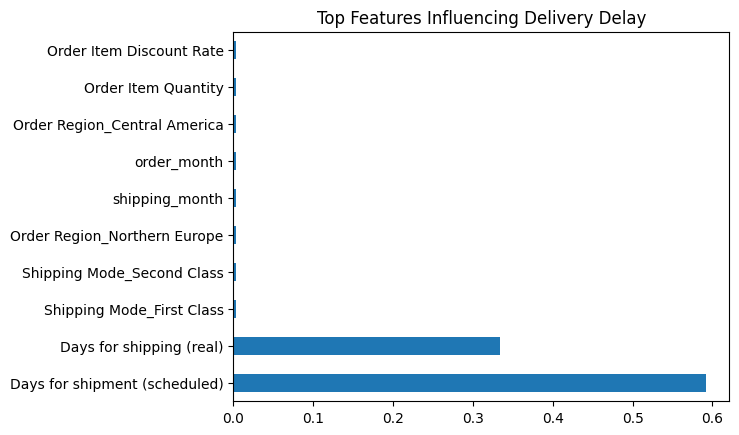
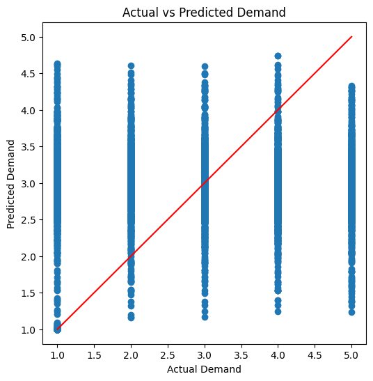

# Supply Chain Analytics & Delivery Delay Prediction

Machine Learning project for **supply chain analytics and delivery delay prediction**.

---

## Project Summary

This project uses machine learning to analyze supply chain logistics data and predict delivery delays.

**Problem:**
Late deliveries reduce supply chain efficiency and impact customer satisfaction.

**Solution:**
Built machine learning models to predict late deliveries and forecast product demand using logistics data.

**Results:**

* Delivery delay prediction accuracy: **~97–98%**
* Demand forecasting model error: **MAE ≈ 0.74**
* Key delay factors identified using **feature importance analysis**

---

## Project Overview

This project applies machine learning techniques to analyze supply chain logistics data and predict delivery delays. The goal is to help businesses identify factors causing shipment delays and improve logistics planning.

---

## Dataset

The dataset used in this project is the **DataCo Global Supply Chain Dataset** containing order information, shipping data, product details, and customer data.

Dataset source:
https://www.kaggle.com/datasets/shashwatwork/dataco-smart-supply-chain-for-big-data-analysis

### Key columns

* Shipping Mode
* Order Region
* Product Price
* Order Item Quantity
* Days for shipment (scheduled)
* Days for shipping (real)

---

## Project Objectives

* Predict late deliveries using classification models
* Forecast product demand using regression models
* Identify key factors influencing logistics delays
* Generate visual insights for supply chain performance

---

## Machine Learning Models

### Delivery Delay Prediction (Classification)

| Model               | Accuracy |
| ------------------- | -------- |
| Logistic Regression | 97.8%    |
| Decision Tree       | 94.7%    |
| Random Forest       | 97.5%    |
| XGBoost             | 97.8%    |

---

### Demand Forecasting (Regression)

Model used:

**Random Forest Regressor**

Evaluation metric:

**Mean Absolute Error (MAE) ≈ 0.74**

---

## Feature Importance



---

## Demand Forecasting



---

## Key Insights

* Delivery delays are strongly influenced by the difference between scheduled shipping days and actual shipping days.
* Shipping mode significantly impacts delivery performance.
* Seasonal demand patterns influence order quantities.

---

## Tools & Libraries

* Python
* Pandas
* NumPy
* Scikit-learn
* XGBoost
* Matplotlib
* Seaborn

---

## Project Structure

```
supply-chain-analytics-ml
│
├── Supply_Chain_Analytics_&_Delivery_Delay_Prediction.ipynb
├── feature_importance.png
├── demand_prediction.png
├── requirements.txt
└── README.md
```

---

## Future Improvements

* Build a real-time logistics monitoring dashboard
* Deploy the model using a web application
* Integrate real-time supply chain data
